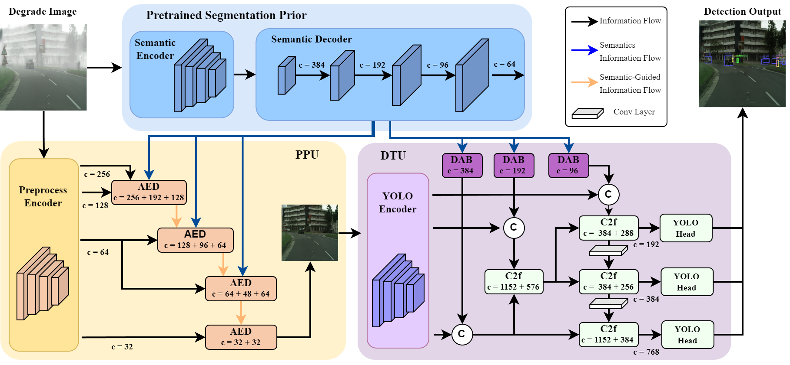
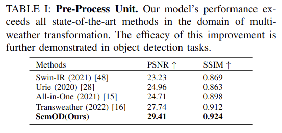

# SemOD: Semantic Enabled Object Detection Network under Various Weather Conditions


## Overview

In the field of autonomous driving, camera-based perception models are mostly trained on clear weather data. Models that focus on addressing specific weather challenges are unable to adapt to various weather changes and primarily prioritize their weather removal characteristics. Our study introduces a semantic-enabled network for object detection in diverse weather conditions. In our analysis, semantics informa-
tion can enable the model to generate plausible content for missing areas, understand object boundaries, and preserve visual coherency and realism across both filled-in and existing portions of the image, which are conducive to image transformation and object recognition. Specific in implementation, our architecture
consists of a Preprocessing Unit (PPU) and a Detection Unit (DTU), where the PPU utilizes a U-shaped net enriched by semantics to refine degraded images, and the DTU integrates this semantic information for object detection using a modified YOLO network. Our method pioneers the use of semantic data for all-weather transformations, resulting in an increase between 1.47% to 11.47% in mAP compared to existing methods across benchmark datasets of different weather. This highlights the potency of semantics in image enhancement and object detection, offering a comprehensive approach to improving object detection performance. 

This is the overall model structure: 



## Datasets and models

(COMING SOON)

## Installation

To run our code, you need to set up the codebase environment first. 

To set up the codebase environment, do the following steps:

**1. Create conda environment (python>=3.8)**

```shell
conda create -n semod python=3.8
conda activate semod
```

**2. Pytorch installation (>=1.12.0 Required)**

Take pytorch 1.12.0 as an example:

```shell
conda install pytorch==1.12.0 torchvision==0.13.0 cudatoolkit=11.3 -c pytorch -c conda-forge
```

**3. Install other dependencies:**

```
pip install -r requirements.txt
```

 ## Quick Start

### 1 Data visualization 

(COMING SOON)

### 2 Train your model

(COMING SOON)

## Performance evaluation results

### 1 Pre-Process Unit Analysis



### 2 Ablation study

Coming soon... :)

### 3 Entire Model

Coming soon...:)
